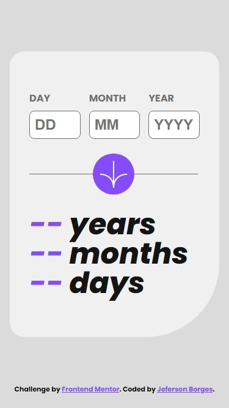
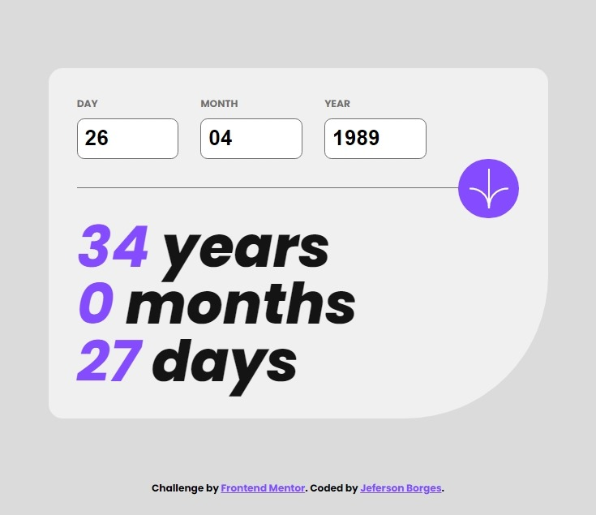
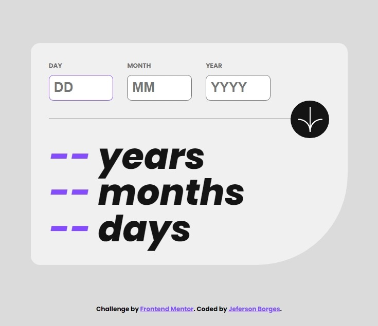
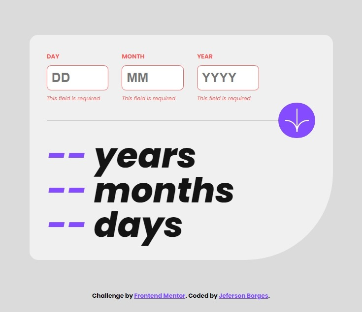
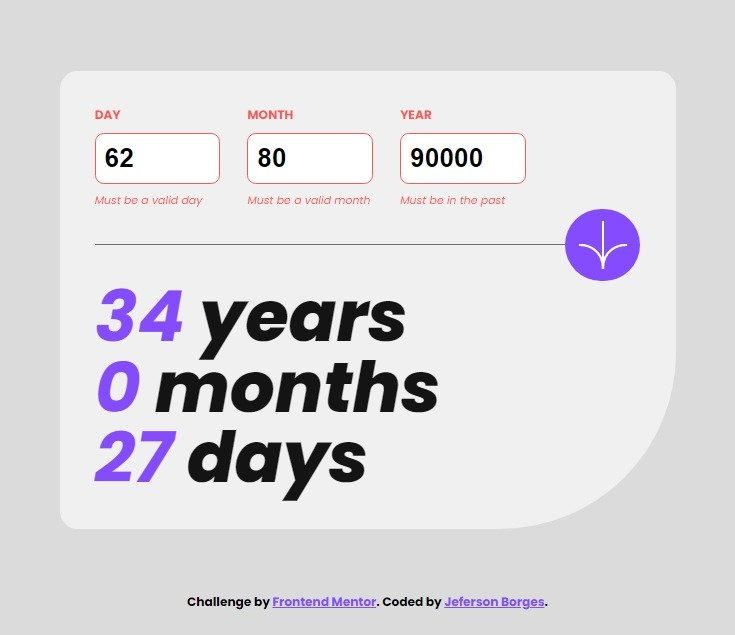
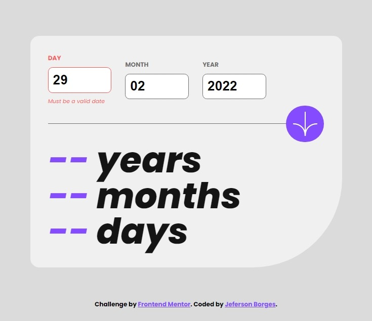

# Frontend Mentor - Age calculator app solution

This is a solution to the [Age calculator app challenge on Frontend Mentor](https://www.frontendmentor.io/challenges/age-calculator-app-dF9DFFpj-Q). This web application allows users to input their birthdate and calculates their age in years, months, and days. The application features a user-friendly interface, responsive design, and error handling for input validation. I also implemented object-oriented programming and event handling concepts to enhance the functionality.

Copy

## Table of contents

- [Overview](#overview)
  - [The challenge](#the-challenge)
  - [Screenshot](#screenshot)
    - [Mobile](#mobile)
    - [Desktop](#mobile)
  - [Links](#links)
- [My process](#my-process)
  - [Built with](#built-with)
  - [What I learned](#what-i-learned)
  - [Continued development](#continued-development)
  - [Useful resources](#useful-resources)
- [Author](#author)

## Overview

### The challenge

Users should be able to:

- View an age in years, months, and days after submitting a valid date through the form
- Receive validation errors if:
  - Any field is empty when the form is submitted
  - The day number is not between 1-31
  - The month number is not between 1-12
  - The year is in the future
  - The date is invalid e.g. 31/04/1991 (there are 30 days in April)
- View the optimal layout for the interface depending on their device's screen size
- See hover and focus states for all interactive elements on the page
- **Bonus**: See the age numbers animate to their final number when the form is submitted

### Screenshot

#### Mobile



#### Desktop







### Links

- Solution URL: [Github repository](https://github.com/jefersonBorges/fem-age_calculator_app)
- Live Site URL: [Github live page](https://jefersonborges.github.io/fem-age_calculator_app/)

## My process

### Built with

- Semantic HTML5 markup
- Flexbox
- CSS Grid
- SASS
- JavaScript
  - DOM
  - OOP
  - Regex
  - Error Handling
  - Event Handling

### What I learned

The validation part of the JavaScript code was interesting to me because it helped me better understand the separation of concerns. In this case, it involves a function nested within the 'ageCalculator' object, which is used for extracting the month value from the input and validating it according to the rules for the month value.

```js

  getMonthValue(e) {

    const monthInputElement = e.target.elements.month
    const inputNotEmpty = monthInputElement.value !== ''

    try{

      if(inputNotEmpty) {

        const inputMonthValue = parseInt(monthInputElement.value - 1)
        const isValidMonth = this.regex.month.test(inputMonthValue)

        if(isValidMonth) {

          return inputMonthValue

        } else { throw this.Error.invalidMonth }

      } else { throw this.Error.required }
      
    } catch(err) { this.errorDisplay(monthInputElement, err.message) }
  },
  
```

Another interesting aspect is the use of the setInterval() function to increment the values of the year, month, and day elements. This is a nested function within the 'ageCalculator' object that receives an HTML element and increments its numerical value based on the endValue, with a specified delay between each increment.

```js

  incrementWithDelay(element, endValue, delay) {
    
    element.innerText = 0
    const increment = 1
    let currentValue = parseInt(element.innerText)

    const intervalId = setInterval( ()=>{

      if(currentValue >= endValue) {
        clearInterval(intervalId)
        return
      }

      currentValue += increment
      element.innerText = currentValue

    }, delay)

  },

```

### Continued development

I would like to keep learning about OOP, event handling and error handling in JavaScript, since those were extremely helpful in this project.

### Useful resources

- [26 Rules I Follow When Writing CSS To Make It Concise and Readable](https://arbaouimehdi.medium.com/26-rules-i-follow-when-writing-css-to-make-it-concise-and-readable-b56547a345b4) - This article is helping me better organize my CSS coding.

- [Interactive controls are keyboard focusable](https://developer.chrome.com/docs/lighthouse/accessibility/focusable-controls/) - This article helping me better understand the focus indicator in the interactive elements on the page.

- [ARIA: alert role](https://developer.mozilla.org/en-US/docs/Web/Accessibility/ARIA/Roles/Alert_Role) - This article is helping me understand the role 'alert' on the page's accessibility features.

- [Date](https://developer.mozilla.org/en-US/docs/Web/JavaScript/Reference/Global_Objects/Date) - Documentation for Javascript Date object.

- [Ano Bissexto](https://pt.wikipedia.org/wiki/Ano_bissexto) - Shows the rules for a Leap year.

- [Understanding Regular Expressions in JavaScript](https://webtips.dev/understanding-regular-expressions-in-javascript) - An article abaout regular expressions for validation uses on Js.

## Author

- GitHub - [jefersonBorges](https://github.com/jefersonBorges/jefersonBorges)
- Frontend Mentor - [@jefersonBorges](https://www.frontendmentor.io/profile/jefersonBorges)
- Linkedin - [Jeferson Borges Linkedin](https://www.linkedin.com/in/jeferson-borges-543b34229)

---
